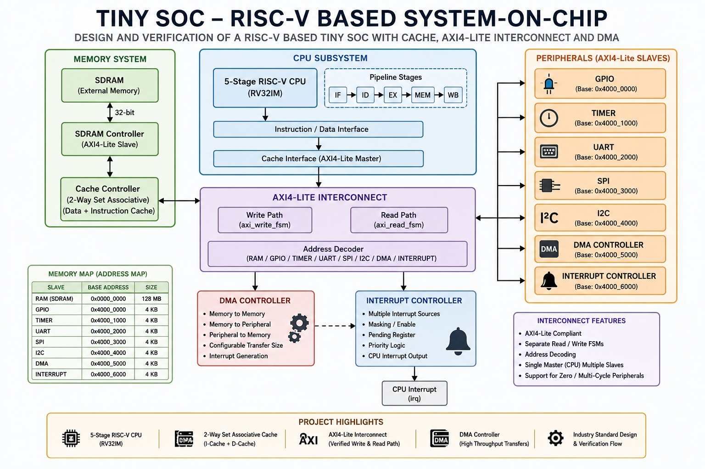
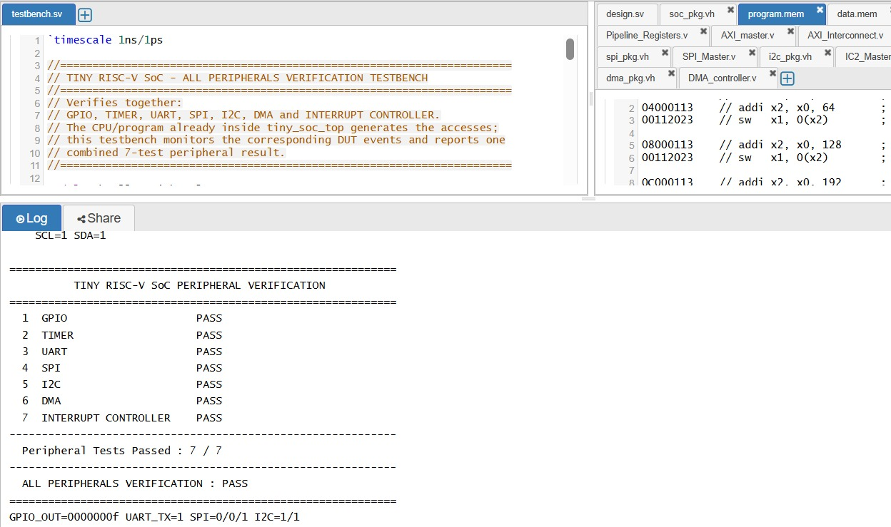
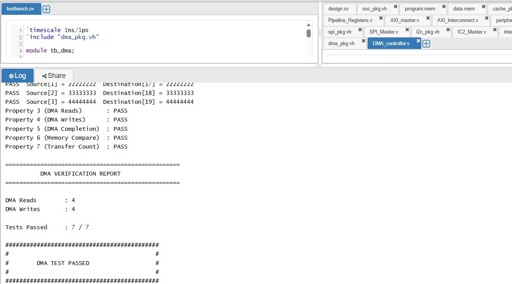

# Tiny RISC-V Based System-on-Chip (SoC)

A modular **Tiny RISC-V based System-on-Chip (SoC)** implemented in Verilog/SystemVerilog that integrates a 5-stage RV32IM processor, 2-way set-associative cache, AXI4-Lite interconnect, SDRAM controller, DMA controller, interrupt controller, and multiple memory-mapped peripherals.

---

## 📖 Overview

This project focuses on the **design and functional verification of a compact RISC-V based SoC** suitable for FPGA-oriented RTL development and SoC architecture study.

The system combines a processor, memory subsystem, AXI4-Lite communication fabric, DMA, interrupt handling, and peripheral controllers into a single modular RTL design.

The RISC-V CPU executes instructions from program memory and performs memory-mapped accesses through the AXI4-Lite interconnect. The interconnect decodes addresses and routes transactions to memory or peripherals.

The complete design was functionally verified using self-checking simulation testbenches and waveform analysis.

---

## ✨ Features

- 5-stage RISC-V RV32IM CPU
- Instruction Fetch, Decode, Execute, Memory and Write-Back pipeline
- 2-way set-associative instruction and data cache
- AXI4-Lite master interface
- AXI4-Lite interconnect with separate read/write paths
- Address decoding for memory-mapped slaves
- SDRAM controller and external memory model
- GPIO controller
- Timer
- UART interface
- SPI master interface
- I²C master interface
- DMA controller
- Interrupt controller
- Self-checking SystemVerilog/Verilog testbenches
- EPWave waveform verification
- Integrated SoC verification
- Peripheral-level verification

---

## 🏗️ Architecture Overview



The main system path is:

```text
                 ┌────────────────────┐
                 │    RISC-V CPU      │
                 │     RV32IM         │
                 └─────────┬──────────┘
                           │
                           ▼
                 ┌────────────────────┐
                 │       Cache        │
                 │ I-Cache + D-Cache  │
                 └─────────┬──────────┘
                           │
                           ▼
                 ┌────────────────────┐
                 │ AXI4-Lite          │
                 │ Interconnect       │
                 └─────────┬──────────┘
                           │
             ┌─────────────┼─────────────────┐
             │             │                 │
             ▼             ▼                 ▼
          Memory       Peripherals        System
             │             │              Control
             │       ┌─────┼─────┐        ┌──┴──┐
             │       │     │     │        │ DMA │
             │      GPIO Timer UART       │ IRQ │
             │      SPI  I2C              └─────┘
             ▼
           SDRAM
```

---

## 🧩 CPU Subsystem


The CPU is a **5-stage RV32IM RISC-V processor**.

```text
IF → ID → EX → MEM → WB
```

### Pipeline stages

| Stage | Function |
|---|---|
| IF | Instruction Fetch |
| ID | Instruction Decode |
| EX | Execute / ALU operation |
| MEM | Memory access |
| WB | Register Write-Back |

The CPU executes the instructions stored in `program.mem`.

A verified CPU bring-up sequence produced:

```text
x1 = 0x00000005
x2 = 0x0000000A
x3 = 0x0000000F
x4 = 0x0000000F

Final PC          = 0x00000014
Final Instruction = 0x00000013
Total Cycles      = 67
```

---

## 🧠 Cache


The cache subsystem uses a **2-way set-associative organization** with instruction and data cache support.

```text
CPU
 │
 ▼
Cache
 ├── Instruction Cache
 └── Data Cache
      │
      ▼
 Lower-level Memory
```

The cache is used to improve memory-access performance by keeping frequently accessed information closer to the CPU.

DMA-cache integration was also functionally verified for destination data integrity.

---

## 🔗 AXI4-Lite Interconnect


The AXI4-Lite interconnect is the communication backbone of the SoC.

It provides:

- AXI4-Lite read handling
- AXI4-Lite write handling
- Separate read/write FSMs
- Address decoding
- Single CPU master to multiple slaves
- Support for zero/multi-cycle peripheral responses

### AXI verification

```text
Write Transactions : 1
Read Transactions  : 1

AW Handshakes      : 1
AR Handshakes      : 1

Write Responses    : 1
Read Responses     : 1

AXI TEST : PASS
```

---

## 🗺️ Memory Map

| Slave | Base Address | Size |
|---|---:|---:|
| RAM / SDRAM | `0x0000_0000` | 128 MB |
| GPIO | `0x4000_0000` | 4 KB |
| Timer | `0x4000_1000` | 4 KB |
| UART | `0x4000_2000` | 4 KB |
| SPI | `0x4000_3000` | 4 KB |
| I²C | `0x4000_4000` | 4 KB |
| DMA | `0x4000_5000` | 4 KB |
| Interrupt Controller | `0x4000_6000` | 4 KB |

---

## 💾 Memory System

The memory subsystem contains:

- Program/instruction memory
- Data memory
- Cache
- SDRAM controller
- External SDRAM model

### SDRAM verification

The SDRAM testbench verifies:

- Reset
- Initialization
- Write transaction
- Read transaction
- Data integrity
- Multiple addresses
- Refresh behavior

```text
SDRAM Tests Passed : 7 / 7
SDRAM TEST : PASS
```

---

## 🔌 Peripherals



The SoC provides several memory-mapped peripherals.

### GPIO

Provides general-purpose digital input/output.

Example verified operation:

```text
Address = 0x40
Data    = 0x0F

GPIO_OUT = 0x0000000F
```

### Timer

Provides hardware counting and timer-event generation.

### UART

Provides serial transmit/receive functionality through the SoC peripheral interface.

### SPI

Provides synchronous serial communication using:

```text
MOSI
MISO
SCLK
CS
```

### I²C

Provides two-wire serial communication using:

```text
SDA
SCL
```

---

## 🚚 DMA Controller



The DMA controller allows data movement with reduced CPU involvement.

Supported verification includes:

- DMA memory reads
- DMA memory writes
- Transfer completion
- Transfer count
- Memory comparison
- Source/destination data integrity
- DMA-cache integration

Example verification:

```text
DMA Reads  : 4
DMA Writes : 4

DMA Tests Passed : 7 / 7
DMA TEST : PASS
```

The DMA-cache integration test also verifies transferred data at the destination.

---

## 🔔 Interrupt Controller


The interrupt controller manages hardware-generated interrupt requests.

Verified features include:

- Reset
- Enable masking
- Sticky pending status
- Fixed priority
- Interrupt acknowledge / next interrupt
- Simultaneous interrupt requests
- Priority progression

```text
Interrupt Controller Tests Passed : 7 / 7
INTERRUPT CONTROLLER TEST : PASS
```

---

## 🔄 SoC Operation Flow

```text
RESET
  │
  ▼
RISC-V CPU
  │
  ▼
Instruction Fetch
  │
  ▼
Decode / Execute
  │
  ▼
Cache
  │
  ▼
AXI4-Lite Master
  │
  ▼
AXI4-Lite Interconnect
  │
  ├────────► Memory / SDRAM
  │
  ├────────► GPIO
  ├────────► Timer
  ├────────► UART
  ├────────► SPI
  ├────────► I²C
  ├────────► DMA
  └────────► Interrupt Controller
```

---

## 📂 Project Structure

```text
Tiny-RISC-V-SoC/
│
├── diagrams/
│   ├── soc_architecture.png
│   ├── cpu_pipeline.png
│   ├── memory_system.png
│   ├── axi_interconnect.png
│   ├── peripherals.png
│   ├── dma.png
│   ├── interrupt_controller.png
│   └── memory_map.png
│
├── memory/
│   ├── program.mem
│   └── data.mem
│
├── rtl/
│   ├── cpu.v
│   ├── Pipeline_Registers.v
│   ├── AXI_master.v
│   ├── AXI_Interconnect.v
│   ├── peripheral.v
│   ├── cache_controller.v
│   ├── sdram.v
│   ├── SPI_Master.v
│   ├── I2C_Master.v
│   ├── DMA_controller.v
│   └── Interrupt_controller.v
│
├── testbench/
│   ├── tb_all_peripherals.sv
│   ├── CPU verification
│   ├── AXI verification
│   ├── SDRAM verification
│   ├── DMA verification
│   └── peripheral verification
│
├── waveforms/
│   ├── all_peripherals_verification.jpeg
│   └── simulation waveform evidence
│
├── report/
│   └── project report
│
├── .gitignore
├── LICENSE
└── README.md
```

---

## 📁 Major RTL Modules

| Module | Description |
|---|---|
| `cpu.v` | 5-stage RV32IM processor |
| `Pipeline_Registers.v` | Pipeline register storage |
| `AXI_master.v` | CPU-side AXI4-Lite master |
| `AXI_Interconnect.v` | AXI transaction routing and address decoding |
| `cache_controller.v` | Cache control and memory interaction |
| `sdram.v` | SDRAM controller / memory interface |
| `peripheral.v` | Peripheral register interface |
| `SPI_Master.v` | SPI controller |
| `I2C_Master.v` | I²C controller |
| `DMA_controller.v` | DMA data transfer controller |
| `Interrupt_controller.v` | Interrupt management and priority |

---

## 🧪 Verification

The design was verified using self-checking simulation testbenches and EPWave waveform analysis.

### Integrated SoC Verification

```text
Reset / Idle             PASS
CPU Boot                 PASS
AXI4-Lite Activity       PASS
GPIO                     PASS
Timer                    PASS
UART                     PASS
SPI                      PASS
I2C                      PASS
DMA                      PASS
Interrupt Controller     PASS

Tests Passed : 10 / 10
SYSTEM VERIFICATION : PASS
```

### Combined Peripheral Verification

A consolidated peripheral testbench verifies all major peripherals together:

```text
GPIO                    PASS
TIMER                   PASS
UART                    PASS
SPI                     PASS
I2C                     PASS
DMA                     PASS
INTERRUPT CONTROLLER    PASS

Peripheral Tests Passed : 7 / 7

ALL PERIPHERALS VERIFICATION : PASS
```


### Waveform Verification

The simulation waveforms demonstrate:

- Clock and reset behavior
- AXI write/read handshaking
- Address decoding
- GPIO write activity
- Timer access
- UART access
- SPI access
- I²C access
- DMA read/write activity
- DMA completion
- Interrupt activity

---

## 🛠️ Tools Used

- Verilog HDL
- SystemVerilog
- EDA Playground
- Icarus Verilog
- EPWave
- Git / GitHub

---

## 🚀 Future Scope

Possible extensions include:

- FPGA implementation and hardware validation
- Vivado synthesis and timing analysis
- FPGA resource utilization analysis
- Improved cache refill and replacement logic
- Expanded DMA functionality
- Additional interrupt sources
- More advanced verification using UVM or formal methods
- Area, timing and power analysis
- Larger memory configurations
- Further SoC peripheral expansion

---

## 👨‍💻 Author

**Leela Shanmukh Yagneek Patnala**

Bachelor of Technology (Electronics and Communication Engineering)

Interested in **RTL Design**, **RISC-V**, **SoC Architecture**, **ASIC Design**, **Digital Design**, and **Functional Verification**.

---

## 📄 License

This project is licensed under the **MIT License**.
